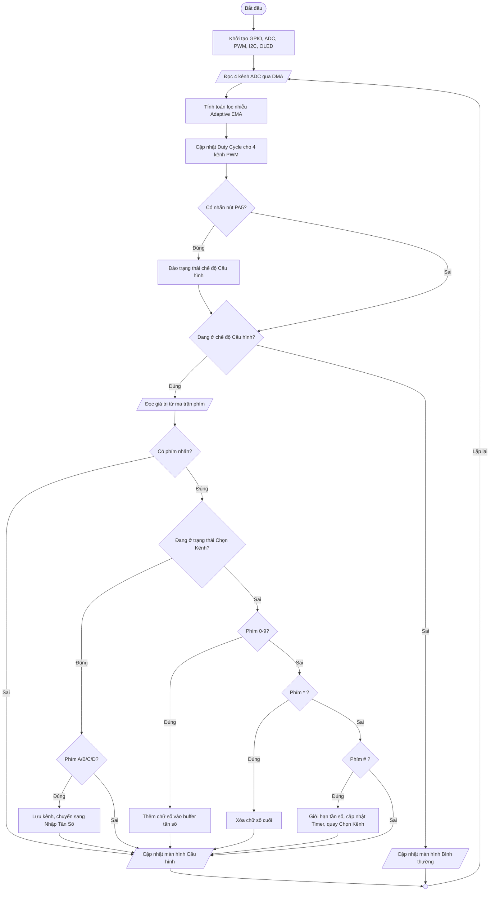

# BÁO CÁO KỸ THUẬT

## HỆ THỐNG SINH PWM 4 KÊNH ĐIỀU KHIỂN BẰNG BIẾN TRỞ
### Tích hợp màn hình OLED SSD1306 và bàn phím ma trận 4×4 trên vi điều khiển STM32F103

---

**Dự án:** `oled`  
**Vi điều khiển:** STM32F103  
**Tần số hệ thống:** 72 MHz  
**Ngày báo cáo:** 20/08/2026  

---

## MỤC LỤC

1. [Giới thiệu](#1-giới-thiệu)
2. [Mục tiêu và yêu cầu hệ thống](#2-mục-tiêu-và-yêu-cầu-hệ-thống)
3. [Kiến trúc tổng thể](#3-kiến-trúc-tổng-thể)
4. [Thiết kế phần cứng](#4-thiết-kế-phần-cứng)
5. [Thiết kế phần mềm](#5-thiết-kế-phần-mềm)
6. [Nguyên lý hoạt động chi tiết](#6-nguyên-lý-hoạt-động-chi-tiết)
7. [Thuật toán xử lý tín hiệu](#7-thuật-toán-xử-lý-tín-hiệu)
8. [Driver OLED SSD1306](#8-driver-oled-ssd1306)
9. [Driver Keypad 4×4](#9-driver-keypad-4×4)
10. [Giao diện người dùng (UI)](#10-giao-diện-người-dùng-ui)
11. [Tối ưu hóa hiệu năng](#11-tối-ưu-hóa-hiệu-năng)
12. [Sơ đồ luồng hoạt động](#12-sơ-đồ-luồng-hoạt-động)
13. [Kết luận](#13-kết-luận)

---

## 1. GIỚI THIỆU

Hệ thống được xây dựng trên nền tảng **STM32F103** với mục đích tạo ra **4 kênh tín hiệu PWM độc lập**, trong đó:

- **Duty cycle (độ rộng xung)** được điều khiển bằng **4 biến trở** thông qua bộ chuyển đổi ADC.
- **Tần số PWM** được cấu hình bằng **bàn phím ma trận 4×4**.
- Thông số vận hành được hiển thị trên **2 màn hình OLED SSD1306** (128×64 pixel, giao tiếp I2C).

Hệ thống vận hành theo hai chế độ:

| Chế độ | Mô tả |
|--------|-------|
| **Bình thường** | Điều khiển duty cycle bằng biến trở, hiển thị tần số + duty trên OLED |
| **Cấu hình** | Nhập tần số từng kênh qua keypad, chuyển đổi bằng nút PA5 |

---

## 2. MỤC TIÊU VÀ YÊU CẦU HỆ THỐNG

### 2.1. Mục tiêu chức năng

| STT | Mục tiêu | Mô tả |
|-----|----------|-------|
| 1 | Sinh PWM 4 kênh | 4 tín hiệu PWM độc lập, tần số và duty cycle riêng biệt |
| 2 | Điều khiển duty cycle | Đọc 4 biến trở, ánh xạ sang duty 0–99% |
| 3 | Cấu hình tần số | Nhập tần số qua keypad, phạm vi 1 Hz – 700 kHz |
| 4 | Hiển thị trực quan | 2 OLED hiển thị tần số, duty cycle và thanh tiến trình |
| 5 | Chuyển đổi chế độ | Nút PA5 bật/tắt chế độ cấu hình |

### 2.2. Yêu cầu phi chức năng

- Phản hồi duty cycle **gần như tức thì** khi xoay biến trở.
- Lọc nhiễu ADC khi biến trở **ổn định**.
- Quét phím **không chặn** vòng lặp chính.
- Cập nhật OLED **có điều kiện** để tránh treo CPU do bus I2C chậm.
- Tận dụng **DMA** cho ADC và **4 timer** độc lập cho PWM.

### 2.3. Yêu cầu cấu hình phần cứng (theo `prompt.md`)

| Thành phần | Chân kết nối |
|------------|--------------|
| Hàng Keypad | PA9, PA8, PB15, PB14 |
| Cột Keypad | PB13, PB12, PB1, PB0 |
| Nút Start-Stop | PA5 |
| Thạch anh | 72 MHz |

---

## 3. KIẾN TRÚC TỔNG THỂ

### 3.1. Sơ đồ khối hệ thống

```
┌──────────────────────────────────────────────────────────────────┐
│                        STM32F103 @ 72MHz                        │
│                                                                  │
│  ┌─────────┐    ┌──────────────┐    ┌─────────────────────────┐ │
│  │ ADC1    │───▶│ Adaptive EMA │───▶│ 4× Timer PWM (TIM1-4)  │─┼──▶ PA10, PA0, PA6, PB6
│  │ + DMA   │    │ Filter       │    │ (Duty + Frequency)      │ │
│  └────▲────┘    └──────────────┘    └───────────▲─────────────┘ │
│       │                                          │               │
│  PA1-PA4                                    Update_Timer_Freq()  │
│  (Biến trở)                                      │               │
│                                                  │               │
│  ┌─────────┐    ┌──────────────┐    ┌───────────┴─────────────┐ │
│  │ Keypad  │───▶│ State Machine│───▶│ UI Screens (ui_screens)│─┼──▶ OLED1 (I2C1)
│  │ 4×4     │    │ + PA5 Button │    │ + SSD1306 Driver       │─┼──▶ OLED2 (I2C2)
│  └─────────┘    └──────────────┘    └─────────────────────────┘ │
│                                                                  │
│  PA7 ──▶ LED báo chế độ cấu hình                                 │
└──────────────────────────────────────────────────────────────────┘
```

### 3.2. Bảng thành phần hệ thống

| Thành phần | Chức năng |
|------------|-----------|
| **ADC + DMA** | Đọc liên tục 4 kênh biến trở, không chiếm CPU |
| **Adaptive EMA** | Lọc nhiễu ADC, vẫn phản hồi nhanh khi xoay biến trở |
| **4 Timer PWM** | Sinh xung độc lập, tần số cấu hình được |
| **2 OLED I2C** | Hiển thị duty/tần số và menu cấu hình |
| **Keypad 4×4** | Nhập tần số từng kênh |
| **Nút PA5** | Chuyển chế độ Bình thường ↔ Cấu hình |

### 3.3. Phân lớp phần mềm

| Lớp | Module | Trách nhiệm |
|-----|--------|-------------|
| **Application** | `main.c` | Vòng lặp chính, điều phối toàn hệ thống |
| **UI** | `ui_screens.c/h` | Vẽ giao diện boot, bình thường, cấu hình |
| **Driver** | `ssd1306.c/h` | Điều khiển OLED qua I2C, framebuffer |
| **Driver** | `Keypad.c/h` | Quét ma trận phím 4×4 |
| **HAL** | STM32 HAL | ADC, DMA, I2C, TIM, GPIO |
| **CMSIS** | Startup, System | Khởi tạo MCU, cấu hình clock |

### 3.4. Cấu trúc file dự án

```
oled/
├── Core/
│   ├── Inc/
│   │   ├── main.h
│   │   ├── ssd1306.h          # Driver OLED
│   │   ├── ui_screens.h       # Giao diện màn hình
│   │   ├── Keypad.h           # Driver bàn phím
│   │   └── logo.h             # Bitmap logo boot
│   └── Src/
│       ├── main.c             # Chương trình chính
│       ├── ssd1306.c
│       ├── ui_screens.c
│       ├── Keypad.c
│       └── stm32f1xx_hal_msp.c
├── Drivers/                   # STM32 HAL & CMSIS
├── MDK-ARM/                   # Keil project
├── Luudo.md                   # Sơ đồ luồng hoạt động
└── prompt.md                  # Yêu cầu dự án
```

---

## 4. THIẾT KẾ PHẦN CỨNG

### 4.1. Cấu hình xung clock

```
HSE (Thạch anh ngoài)
    │
    ▼
  PLL ×9
    │
    ▼
SYSCLK = 72 MHz
    ├── AHB  = 72 MHz
    ├── APB2 = 72 MHz  (Timer1 clock = 72 MHz)
    └── APB1 = 36 MHz  (Timer2/3/4 clock = 72 MHz, nhân đôi)

ADC Clock = PCLK2 / 6 = 12 MHz
I2C Clock = 400 kHz (Fast Mode)
```

### 4.2. Bảng ánh xạ chân GPIO

#### a) Kênh ADC — đọc biến trở

| Kênh logic | Chân MCU | ADC Channel | Chức năng |
|------------|----------|-------------|-----------|
| CH1 | PA1 | ADC1_IN1 | Điều khiển duty kênh 1 |
| CH2 | PA2 | ADC1_IN2 | Điều khiển duty kênh 2 |
| CH3 | PA3 | ADC1_IN3 | Điều khiển duty kênh 3 |
| CH4 | PA4 | ADC1_IN4 | Điều khiển duty kênh 4 |

#### b) Kênh PWM — xuất tín hiệu

| Kênh | Timer | Kênh Timer | Chân MCU | Biến tần số |
|------|-------|------------|----------|-------------|
| CH1 | TIM1 | CH3 | PA10 | `freq1` |
| CH2 | TIM2 | CH1 | PA0 | `freq2` |
| CH3 | TIM3 | CH1 | PA6 | `freq3` |
| CH4 | TIM4 | CH1 | PB6 | `freq4` |

#### c) Giao tiếp I2C — màn hình OLED

| Thiết bị | Bus I2C | Địa chỉ | Hiển thị |
|----------|---------|---------|----------|
| OLED 1 | I2C1 | 0x3C | CH1, CH2 hoặc menu cấu hình |
| OLED 2 | I2C2 | 0x3C | CH3, CH4 hoặc tần số hiện tại |

#### d) Bàn phím ma trận 4×4

| Loại | Chân MCU | Ghi chú |
|------|----------|---------|
| Hàng 1 (R1) | PA9 | Output, quét tuần tự |
| Hàng 2 (R2) | PA8 | Output |
| Hàng 3 (R3) | PB15 | Output |
| Hàng 4 (R4) | PB14 | Output |
| Cột 1 (C1) | PB13 | Input Pull-up |
| Cột 2 (C2) | PB12 | Input Pull-up |
| Cột 3 (C3) | PB1 | Input Pull-up |
| Cột 4 (C4) | PB0 | Input Pull-up |

**Bảng ánh xạ phím:**

```
┌─────┬─────┬─────┬─────┐
│  1  │  2  │  3  │  A  │  ← CH1
├─────┼─────┼─────┼─────┤
│  4  │  5  │  6  │  B  │  ← CH2
├─────┼─────┼─────┼─────┤
│  7  │  8  │  9  │  C  │  ← CH3
├─────┼─────┼─────┼─────┤
│  *  │  0  │  #  │  D  │  ← CH4 / Xóa / Lưu
└─────┴─────┴─────┴─────┘
```

#### e) Điều khiển và báo trạng thái

| Chân | Chức năng | Cấu hình |
|------|-----------|----------|
| PA5 | Nút chuyển chế độ | Input, Pull-up, active LOW |
| PA7 | LED báo chế độ cấu hình | Output, HIGH = đang cấu hình |

### 4.3. Cấu hình ADC

| Tham số | Giá trị |
|---------|---------|
| Chế độ quét | Scan mode (4 kênh tuần tự) |
| Chế độ chuyển đổi | Continuous |
| Số kênh | 4 (Rank 1–4) |
| Thời gian lấy mẫu | 71.5 cycles |
| Độ phân giải | 12-bit (0–4095) |
| Truyền dữ liệu | DMA Circular → `adc_values[4]` |

---

## 5. THIẾT KẾ PHẦN MỀM

### 5.1. Biến toàn cục quan trọng

```c
// Dữ liệu ADC (DMA ghi trực tiếp)
volatile uint16_t adc_values[4];

// Giá trị sau lọc EMA
uint16_t var[4];

// Duty cycle 0–99%
uint16_t pwm_duty[4];

// Tần số từng kênh (Hz), mặc định 10 Hz
uint32_t freq1, freq2, freq3, freq4;

// State machine cấu hình
uint8_t is_config_mode;         // 0: Bình thường, 1: Cấu hình
uint8_t config_state;           // 0: Chọn kênh, 1: Nhập tần số
uint8_t config_channel;         // Kênh đang cấu hình (1–4)
uint32_t freq_input_buffer;     // Bộ đệm nhập tần số
uint8_t config_ui_needs_update; // Cờ yêu cầu vẽ lại UI
```

### 5.2. State Machine — chế độ cấu hình

```
                    ┌─────────────────┐
                    │  Bình thường    │
                    │ is_config=0     │
                    └────────┬────────┘
                             │ Nhấn PA5
                             ▼
                    ┌─────────────────┐
         ┌─────────│  Chọn kênh      │◀──────────────┐
         │         │ config_state=0  │               │
         │         └────────┬────────┘               │
         │                  │ A/B/C/D                 │
         │                  ▼                         │
         │         ┌─────────────────┐               │
         │         │  Nhập tần số    │               │
         │         │ config_state=1  │               │
         │         └────────┬────────┘               │
         │                  │                         │
         │    ┌─────────────┼─────────────┐           │
         │    │ 0-9         │ *           │ #         │
         │    ▼             ▼             ▼         │
         │ Thêm số      Xóa số cuối   Lưu + cập nhật │
         │    │             │             │         │
         │    └─────────────┴─────────────┴─────────┘
         │
         │ Nhấn PA5
         ▼
    Quay về Bình thường
```

| Trạng thái | Phím | Hành động |
|------------|------|-----------|
| **Chọn kênh** (`config_state=0`) | A/B/C/D | Chọn CH1–CH4, chuyển sang nhập tần số |
| **Nhập tần số** (`config_state=1`) | 0–9 | Thêm chữ số vào buffer |
| | `*` | Xóa chữ số cuối (`/= 10`) |
| | `#` | Lưu (1 Hz–700 kHz), cập nhật timer, quay menu |

---

## 6. NGUYÊN LÝ HOẠT ĐỘNG CHI TIẾT

### 6.1. Giai đoạn khởi động

**Trình tự khởi tạo** (thực hiện một lần sau reset):

| Bước | Thao tác | Mục đích |
|------|----------|----------|
| 1 | `HAL_Init()` | Khởi tạo HAL, SysTick |
| 2 | `SystemClock_Config()` | Cấu hình clock 72 MHz |
| 3 | `MX_GPIO/ADC/I2C/TIM/DMA_Init()` | Khởi tạo ngoại vi |
| 4 | `SSD1306_Init()` × 2 | Khởi tạo 2 màn OLED |
| 5 | `HAL_TIM_PWM_Start()` × 4 | Bật 4 kênh PWM |
| 6 | `HAL_ADCEx_Calibration_Start()` | Hiệu chuẩn ADC |
| 7 | `HAL_ADC_Start_DMA()` | Bắt đầu đọc ADC liên tục |
| 8 | `UI_ShowBootScreen()` + delay 2s | Màn hình khởi động |
| 9 | Khởi tạo EMA từ ADC thực | Tránh ramp-up chậm |
| 10 | `Keypad_Init()` | Khởi tạo bàn phím |
| 11 | `Update_Timer_Freq()` × 4 | Thiết lập tần số ban đầu |

**Lưu ý thiết kế boot screen:** Không gọi `HAL_Delay()` bên trong `SSD1306_Init()` hay `UI_ShowBootScreen()` — delay được thực hiện **một lần duy nhất** bên ngoài sau khi vẽ cả 2 màn hình, đảm bảo OLED1 và OLED2 đồng bộ.

### 6.2. Vòng lặp chính (`while(1)`)

Mỗi vòng lặp thực hiện **5 bước tuần tự**:

```
┌─────────────────────────────────────────────────────────┐
│ BƯỚC 1: Đọc & lọc ADC (Adaptive EMA)                     │
│         adc_values[i] → var[i] → pwm_duty[i]            │
├─────────────────────────────────────────────────────────┤
│ BƯỚC 2: Cập nhật PWM (CCR register)                      │
│         pwm_duty[i] → TIMx->CCR                          │
├─────────────────────────────────────────────────────────┤
│ BƯỚC 3: Kiểm tra nút PA5 (debounce 50ms)                 │
│         Toggle is_config_mode                            │
├─────────────────────────────────────────────────────────┤
│ BƯỚC 4: Xử lý chế độ cấu hình (nếu bật)                  │
│         Keypad → State Machine → Update_Timer_Freq()     │
├─────────────────────────────────────────────────────────┤
│ BƯỚC 5: Cập nhật OLED (có điều kiện)                     │
│         Bình thường: 100ms, chỉ khi duty đổi            │
│         Cấu hình: khi có thay đổi trạng thái/phím       │
└─────────────────────────────────────────────────────────┘
                          │
                          ▼
                    Lặp lại vòng
```

### 6.3. Cơ chế sinh PWM

**Công thức tần số PWM:**

\[
f_{PWM} = \frac{f_{TIM}}{(PSC + 1) \times (ARR + 1)} = \frac{72\,000\,000}{(PSC + 1) \times (ARR + 1)}
\]

**Công thức duty cycle:**

\[
Duty\ (\%) = \frac{CCR}{ARR + 1} \times 100\%
\]

**Hàm `Update_Timer_Freq()`:**

```c
void Update_Timer_Freq(uint8_t ch, uint32_t freq) {
    if (freq == 0) freq = 1;

    uint32_t total_div = 72000000 / freq;
    if (total_div == 0) total_div = 1;

    // PSC tối ưu: ARR lớn nhất → duty cycle mịn nhất
    uint32_t psc = (total_div - 1) / 65536;
    uint32_t arr = (total_div / (psc + 1)) - 1;

    // Ghi vào thanh ghi TIM1–TIM4 tương ứng
}
```

**Ví dụ:** Tần số 1000 Hz, duty 50%:
- `total_div = 72000000 / 1000 = 72000`
- `psc = 0`, `arr = 71999`
- `CCR = (50 × 71999) / 99 ≈ 36363`

### 6.4. Cơ chế đọc ADC qua DMA

```
ADC1 ──(Scan 4 kênh)──▶ DMA1 Channel 1 ──▶ adc_values[4]
                                              │
                                              ▼
                                    (Circular mode)
                                    Tự động ghi đè
                                    khi đủ 4 mẫu
```

- CPU **không tham gia** đọc ADC.
- Mảng `adc_values` luôn chứa **4 giá trị mới nhất**.
- Vòng lặp chính chỉ **đọc mảng** và xử lý.

### 6.5. Luồng dữ liệu tổng thể

```
┌─────────────────────────────────────────────────────────────┐
│                    VÒNG LẶP while(1)                        │
├─────────────────────────────────────────────────────────────┤
│                                                             │
│  [DMA nền] adc_values[0..3]  ←── 4 biến trở (PA1-PA4)     │
│       │                                                     │
│       ▼                                                     │
│  Adaptive EMA Filter → var[0..3] → pwm_duty[0..3] (0-99%)  │
│       │                                                     │
│       ▼                                                     │
│  Cập nhật CCR Timer 1-4 ──→ 4 chân PWM (PA10,PA0,PA6,PB6)│
│                                                             │
│  PA5? ──→ Toggle is_config_mode                             │
│                                                             │
│  is_config_mode?                                            │
│    ├─ NO  → OLED: duty + freq (100ms, chỉ khi đổi)         │
│    └─ YES → Keypad → State Machine → Update_Timer_Freq()   │
│              OLED: menu / nhập số / tần số hiện tại         │
│              PA7 LED ON                                     │
└─────────────────────────────────────────────────────────────┘
```

---

## 7. THUẬT TOÁN XỬ LÝ TÍN HIỆU

### 7.1. Bộ lọc Adaptive EMA (Exponential Moving Average)

**Mục đích:** Cân bằng giữa **phản hồi nhanh** (khi xoay biến trở) và **lọc nhiễu tốt** (khi ổn định).

**Công thức:**

\[
var_{new} = var_{old} + \frac{raw - var_{old}}{\alpha}
\]

**Tham số:**

| Hằng số | Giá trị | Ý nghĩa |
|---------|---------|---------|
| `EMA_ALPHA_SLOW` | 16 | Hệ số lọc khi ổn định (~16 mẫu) |
| `EMA_ALPHA_FAST` | 2 | Hệ số lọc khi xoay nhanh (~2 mẫu) |
| `EMA_FAST_THRESH` | 80 | Ngưỡng chuyển đổi (~2% trên thang 4095) |

**Logic chọn alpha:**

```c
delta = |raw - var|
if (delta > 80)
    alpha = 2   → Phản hồi nhanh, bám theo biến trở ngay
else
    alpha = 16  → Lọc nhiễu mạnh, đường tín hiệu mượt
```

**Đồ thị minh họa:**

```
Giá trị ADC
    │
4095├─────────────────────────────
    │         ╱╲    ← Xoay nhanh: bám theo ngay (α=2)
    │        ╱  ╲
    │───────╱────╲────────────── ← Ổn định: đường mượt (α=16)
    │
    0└────────────────────────────▶ Thời gian
```

### 7.2. Ánh xạ ADC sang Duty Cycle

```c
pwm_duty[i] = (var[i] * 100) / 4095;  // 0–99%
if (pwm_duty[i] > 99) pwm_duty[i] = 99;
```

| Giá trị ADC | Duty Cycle |
|-------------|------------|
| 0 | 0% |
| 2048 | ~50% |
| 4095 | 99% (giới hạn) |

### 7.3. Cập nhật PWM trong vòng lặp

```c
__HAL_TIM_SET_COMPARE(&htim1, TIM_CHANNEL_3, (pwm_duty[0] * TIM1->ARR) / 99);
__HAL_TIM_SET_COMPARE(&htim2, TIM_CHANNEL_1, (pwm_duty[1] * TIM2->ARR) / 99);
__HAL_TIM_SET_COMPARE(&htim3, TIM_CHANNEL_1, (pwm_duty[2] * TIM3->ARR) / 99);
__HAL_TIM_SET_COMPARE(&htim4, TIM_CHANNEL_1, (pwm_duty[3] * TIM4->ARR) / 99);
```

Duty cycle được cập nhật **mỗi vòng lặp** (hàng nghìn lần/giây), sử dụng `ARR` thực tế của từng timer để tính CCR chính xác theo tần số hiện tại.

---

## 8. DRIVER OLED SSD1306

### 8.1. Nguyên lý hoạt động

Driver sử dụng mô hình **framebuffer cục bộ**:

1. Vẽ đồ họa vào `dev->buffer[1024]` (128×64 pixel, 1 bit/pixel).
2. `SSD1306_UpdateScreen()` gửi buffer qua I2C theo từng page (8 hàng pixel).

### 8.2. Giao thức I2C

| Control byte | Ý nghĩa |
|--------------|---------|
| `0x00` | Byte tiếp theo là **lệnh** (command) |
| `0x40` | Byte tiếp theo là **dữ liệu** (data) |

### 8.3. Tối ưu I2C

- Gộp nhiều lệnh trong **một giao dịch I2C** (4 byte: control + 3 command).
- Gửi cả dòng 128 byte/lần thay vì từng byte.
- Không `HAL_Delay` trong init — tránh 2 màn hình lệch pha khi boot.

### 8.4. Các hàm vẽ cơ bản

| Hàm | Chức năng |
|-----|-----------|
| `SSD1306_Clear()` | Xóa framebuffer |
| `SSD1306_UpdateScreen()` | Đẩy buffer lên màn hình |
| `SSD1306_DrawPixel()` | Vẽ 1 pixel |
| `SSD1306_DrawString()` | Vẽ chuỗi ký tự (font 5×7) |
| `SSD1306_DrawRect()` | Vẽ hình chữ nhật |
| `SSD1306_DrawHLine()` | Vẽ đường ngang |
| `SSD1306_DrawProgressBar()` | Vẽ thanh tiến trình |
| `SSD1306_DrawBitmap()` | Vẽ bitmap (logo) |

---

## 9. DRIVER KEYPAD 4×4

### 9.1. Nguyên lý quét ma trận

```
Bước 1: Kéo hàng R1 xuống LOW
Bước 2: Đọc 4 cột (PB13, PB12, PB1, PB0)
        → Cột nào LOW = có phím tại (R1, cột đó)
Bước 3: Trả hàng R1 về HIGH
Bước 4: Lặp với R2, R3, R4
```

### 9.2. Debounce và edge detection

| Kỹ thuật | Tham số | Mục đích |
|----------|---------|----------|
| Throttle quét | 20 ms | Giảm tải CPU |
| Edge detect | Chỉ trả về khi phím **mới** nhấn | Tránh lặp ký tự |
| Non-blocking | Trả về 0 nếu chưa đến lượt quét | Không chặn vòng lặp chính |

### 9.3. Bảng ánh xạ phím (`keymap`)

```c
static const char keymap[4][4] = {
    {'1', '2', '3', 'A'},
    {'4', '5', '6', 'B'},
    {'7', '8', '9', 'C'},
    {'*', '0', '#', 'D'}
};
```

---

## 10. GIAO DIỆN NGƯỜI DÙNG (UI)

### 10.1. Danh sách màn hình

| STT | Hàm | Màn hình | Điều kiện hiển thị |
|-----|-----|----------|-------------------|
| 1 | `UI_ShowBootScreen()` | Logo + "PWM generator" | Khởi động (2 giây) |
| 2 | `UI_ShowPage1()` | CH1 & CH2: tần số, duty, progress bar | Bình thường, OLED1 |
| 3 | `UI_ShowPage2()` | CH3 & CH4: tần số, duty, progress bar | Bình thường, OLED2 |
| 4 | `UI_ShowConfigMenu()` | Menu chọn kênh A/B/C/D | Cấu hình, OLED1 |
| 5 | `UI_ShowFreqInput()` | Nhập tần số kênh đã chọn | Sau khi chọn kênh |
| 6 | `UI_ShowConfigWait()` | Liệt kê tần số 4 kênh | Cấu hình, OLED2 |

### 10.2. Mẫu giao diện

**Màn hình Boot:**

```
┌────────────────────────────────┐
│ ┌────────────────────────────┐ │
│ │        [LOGO HAUI]         │ │
│ │                            │ │
│ │     PWM generator          │ │
│ └────────────────────────────┘ │
└────────────────────────────────┘
```

**Màn hình bình thường (Page 1 — OLED1):**

```
┌────────────────────────────────┐
│ [PAGE 1] CH1 & CH2             │
│────────────────────────────────│
│ 1:1,000Hz D1:45%               │
│ [===============>            ] │
│                                │
│ 2:50Hz D2:80%                  │
│ [=============================>]│
└────────────────────────────────┘
```

**Màn hình bình thường (Page 2 — OLED2):**

```
┌────────────────────────────────┐
│ [PAGE 2] CH3 & CH4             │
│────────────────────────────────│
│ 3:1,000Hz D3:45%               │
│ [===============>            ] │
│                                │
│ 4:50Hz D4:80%                  │
│ [=============================>]│
└────────────────────────────────┘
```

**Màn hình cấu hình — chọn kênh (OLED1):**

```
┌────────────────────────────────┐
│ [CONFIG MODE]                  │
│────────────────────────────────│
│ Select Channel:                │
│ A: CH1   B: CH2                │
│ C: CH3   D: CH4                │
│ PA5 to Exit                    │
└────────────────────────────────┘
```

**Màn hình cấu hình — tần số hiện tại (OLED2):**

```
┌────────────────────────────────┐
│ [CURRENT FREQ]                 │
│────────────────────────────────│
│ 1: 10 Hz                       │
│ 2: 10 Hz                       │
│ 3: 10 Hz                       │
│ 4: 10 Hz                       │
└────────────────────────────────┘
```

**Màn hình nhập tần số (OLED1):**

```
┌────────────────────────────────┐
│ [INPUT] CH2                    │
│────────────────────────────────│
│ Enter Freq (Hz):               │
│ > 50,000_                      │
│                                │
│ #:Save  *:Del                  │
└────────────────────────────────┘
```

### 10.3. Quy trình cấu hình tần số

```
1. Nhấn PA5          → Vào chế độ cấu hình, LED PA7 sáng
2. Nhấn A/B/C/D      → Chọn kênh 1/2/3/4
3. Nhấn 0–9          → Nhập từng chữ số tần số
4. Nhấn *            → Xóa chữ số cuối (nếu nhập sai)
5. Nhấn #            → Lưu tần số (1 Hz – 700 kHz), cập nhật timer
6. Lặp bước 2–5      → Cấu hình kênh khác
7. Nhấn PA5          → Thoát cấu hình, quay chế độ bình thường
```

### 10.4. Chiến lược cập nhật OLED

**Chế độ bình thường:**
- Cập nhật tối đa **100 ms/lần**.
- Chỉ vẽ khi `pwm_duty` thay đổi.
- OLED1 và OLED2 lệch pha 50 ms để tránh tranh CPU.

**Chế độ cấu hình:**
- Vẽ **khi có thay đổi** (`config_ui_needs_update = 1`).
- Không vẽ liên tục → I2C không làm treo quét phím.

---

## 11. TỐI ƯU HÓA HIỆU NĂNG

### 11.1. Bảng các kỹ thuật tối ưu

| Kỹ thuật | Vị trí áp dụng | Lợi ích |
|----------|----------------|---------|
| **ADC + DMA Circular** | `HAL_ADC_Start_DMA()` | CPU không block khi đọc ADC |
| **Adaptive EMA** | Vòng lặp chính | Cân bằng mượt/nhanh, không cần buffer lớn |
| **4 Timer độc lập** | TIM1, TIM2, TIM3, TIM4 | 4 tần số PWM khác nhau |
| **PSC/ARR động** | `Update_Timer_Freq()` | Tần số linh hoạt, duty mịn (ARR lớn) |
| **OLED cập nhật có điều kiện** | `main.c` Bước 5 | Giảm tải I2C, tránh treo vòng lặp |
| **Keypad non-blocking** | `Keypad_GetKey()` | Quét phím không chặn, debounce 20ms |
| **2 bus I2C riêng** | I2C1, I2C2 | 2 OLED không tranh bus |
| **Gộp lệnh I2C** | `SSD1306_UpdateScreen()` | Giảm số giao dịch I2C |
| **Không delay trong init OLED** | `SSD1306_Init()` | 2 màn hình đồng bộ khi boot |
| **Debounce PA5** | 50 ms, edge detect | Tránh chuyển chế độ nhầm |

### 11.2. Phân tích thời gian vòng lặp

| Thành phần | Thời gian ước tính |
|------------|-------------------|
| Lọc EMA (4 kênh) | < 10 µs |
| Cập nhật CCR (4 timer) | < 5 µs |
| Quét PA5 | < 1 µs |
| Quét Keypad | < 50 µs (mỗi 20ms) |
| Cập nhật OLED | 0 (chỉ khi thay đổi) hoặc ~20–50 ms |

**Kết luận:** Vòng lặp chạy với tần số **hàng nghìn Hz**, đảm bảo phản hồi duty cycle gần như tức thì.

---

## 12. SƠ ĐỒ LUỒNG HOẠT ĐỘNG

### 12.1. Luồng tổng thể (theo `Luudo.md`)



### 12.2. Luồng khởi động tổng hợp

```
[Cấp nguồn]
     │
     ▼
[Khởi tạo MCU, OLED, PWM, ADC+DMA, Keypad]
     │
     ▼
[Màn hình Boot 2 giây]
     │
     ▼
┌────────────────────────────────────────────┐
│              VÒNG LẶP CHÍNH                │
│                                            │
│  Biến trở ──▶ ADC+DMA ──▶ EMA ──▶ PWM     │
│                              │             │
│                              ▼             │
│                           OLED (100ms)     │
│                                            │
│  PA5 ──▶ Chế độ Cấu hình ──▶ Keypad       │
│                              │             │
│                              ▼             │
│                     Cập nhật Tần số Timer │
└────────────────────────────────────────────┘
```

---

## 13. KẾT LUẬN

### 13.1. Tóm tắt hệ thống

Hệ thống **Sinh PWM 4 kênh** trên STM32F103 đã đáp ứng đầy đủ các yêu cầu:

1. **Sinh 4 kênh PWM độc lập** với tần số cấu hình được (1 Hz – 700 kHz) và duty cycle điều khiển bằng biến trở (0–99%).

2. **Xử lý tín hiệu thông minh** với bộ lọc Adaptive EMA, cân bằng giữa phản hồi nhanh và lọc nhiễu.

3. **Giao diện người dùng trực quan** trên 2 màn OLED, hiển thị tần số, duty cycle và thanh tiến trình.

4. **Cấu hình linh hoạt** qua bàn phím ma trận 4×4 với state machine rõ ràng.

5. **Tối ưu hiệu năng** nhờ DMA, timer độc lập, và chiến lược cập nhật OLED có điều kiện.

### 13.2. Chức năng người dùng cuối

| Hành động | Kết quả |
|-----------|---------|
| Xoay biến trở | Duty cycle thay đổi real-time trên PWM và OLED |
| Nhấn PA5 | Vào/thoát chế độ cấu hình tần số |
| Nhấn A/B/C/D | Chọn kênh 1/2/3/4 để cấu hình |
| Nhập số + `#` | Lưu tần số mới cho kênh đã chọn |
| Nhấn `*` | Xóa chữ số cuối khi nhập sai |

### 13.3. Hướng phát triển (tham khảo)

- Lưu tần số vào **EEPROM/Flash** để giữ cấu hình sau mất điện.
- Thêm **điều chỉnh duty cycle bằng keypad** (ngoài biến trở).
- Hỗ trợ **preset tần số** (lưu/nhớ các giá trị thường dùng).
- Giao tiếp **UART/USB** để cấu hình từ máy tính.

---

## PHỤ LỤC

### A. File mã nguồn chính

| File | Vai trò |
|------|---------|
| `Core/Src/main.c` | Vòng lặp chính, ADC, PWM, state machine |
| `Core/Src/ui_screens.c` | Giao diện 6 màn hình OLED |
| `Core/Src/ssd1306.c` | Driver OLED SSD1306 qua I2C |
| `Core/Src/Keypad.c` | Driver quét ma trận phím 4×4 |
| `Core/Src/stm32f1xx_hal_msp.c` | Cấu hình chân GPIO cho ADC, I2C, TIM |
| `Luudo.md` | Sơ đồ luồng hoạt động (Mermaid) |
| `prompt.md` | Yêu cầu ban đầu của dự án |

### B. Thông số kỹ thuật tóm tắt

| Thông số | Giá trị |
|----------|---------|
| Vi điều khiển | STM32F103 |
| Clock hệ thống | 72 MHz |
| Số kênh PWM | 4 (độc lập) |
| Phạm vi tần số | 1 Hz – 700 kHz |
| Phạm vi duty cycle | 0 – 99% |
| Độ phân giải ADC | 12-bit (4096 mức) |
| Màn hình | 2 × SSD1306 (128×64, I2C) |
| Bàn phím | Ma trận 4×4 (16 phím) |

---

**— Hết báo cáo —**
